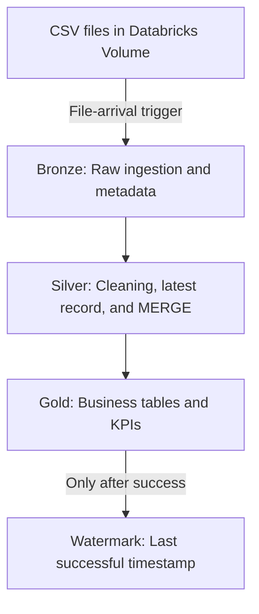

# Pipeline Architecture

## Workflow Dependencies

The Databricks Job runs the tasks in this order:

`bronze_ingestion → silver_processing → gold_tables → watermark_update`

If a task fails, its dependent tasks do not run. This prevents the watermark from advancing before the data has been processed successfully.

## SQL Execution Order

The files under `sql/` are numbered to match the order they must run in:

| File | What it does | Depends on |
|---|---|---|
| `00_setup_tables.sql` | Creates `bronze_sales_v2`, `silver_sales_v2`, and `pipeline_watermark` if they don't already exist, and seeds the initial `bronze_to_silver_sales` watermark row. | Requires a Databricks catalog and schema to be selected. Does not require the Volume to exist. Safe to rerun (see the file's own comments). |
| `01_bronze_ingestion.sql` | `COPY INTO bronze_sales_v2` — ingests any new CSV files from the configured Volume path and attaches ingestion metadata. | `00_setup_tables.sql` must have run. New CSV file(s) must exist in the Volume. |
| `02_silver_processing.sql` | Selects Bronze rows newer than the current watermark, dedupes to the latest row per `InvoiceNo + StockCode`, and `MERGE`s into `silver_sales_v2`. | `01_bronze_ingestion.sql` must have run for this batch. |
| `03_gold_tables.sql` | Rebuilds the four Gold tables (`gold_kpis_v2`, `gold_monthly_sales_v2`, `gold_sales_by_country_v2`, `gold_top_products_v2`) from `silver_sales_v2`. | `02_silver_processing.sql` must have run. |
| `04_watermark_update.sql` | Advances `pipeline_watermark.last_processed_timestamp` to `MAX(ingestion_timestamp)` from `bronze_sales_v2`. | Runs last, and only after Gold succeeds — see below. |

### What's SQL vs. what's Databricks UI configuration

Only the table/data logic above lives in this repository as SQL. The following are configured directly in the Databricks UI and are **not** exported here as files:

- Creating the Databricks Job and its four tasks (`bronze_ingestion`, `silver_processing`, `gold_tables`, `watermark_update`). A Job task cannot run a local repository file directly: a saved Databricks SQL query must first be created using the contents of the corresponding repository SQL file, and each Job task is configured to run that saved query.
- Wiring the task dependency chain shown in the diagram above.
- The file-arrival trigger on the Volume path used by `01_bronze_ingestion.sql`.
- Running a Repair Run after a failed task.

### Why the watermark task runs last

`04_watermark_update.sql` is deliberately the last task and is configured to depend on `gold_tables` succeeding. If Bronze, Silver, or Gold fails, the watermark task does not run, so `last_processed_timestamp` stays at its previous value. That keeps the corresponding Bronze rows eligible for reprocessing by `02_silver_processing.sql` on the next successful run, instead of silently being skipped because the watermark had already moved past them.
