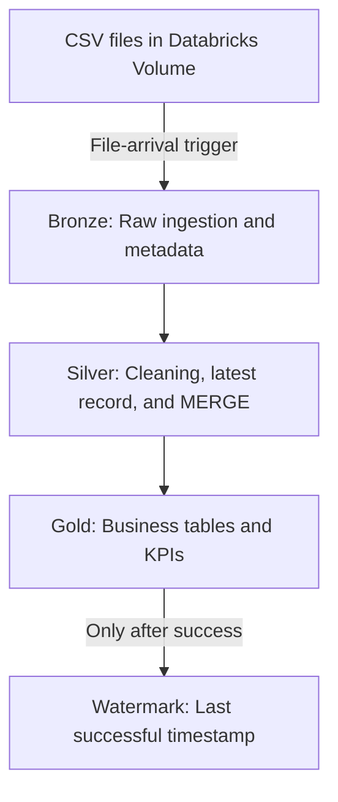

# Pipeline Architecture

## Workflow Dependencies

The Databricks Job runs the tasks in this order:

`bronze_ingestion → silver_processing → gold_tables → watermark_update`

If a task fails, its dependent tasks do not run. This prevents the watermark from advancing before the data has been processed successfully.